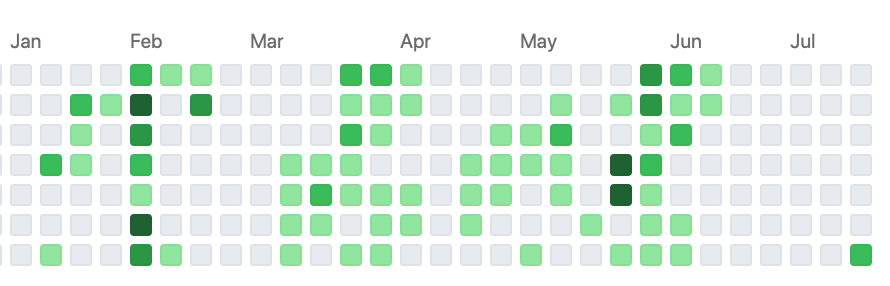

This is my first post on my new blog! How exciting!

I just want to say that becoming a better developer is not difficult, however it takes being consistent. Looking back at this past year, there have been attempts to code every day. Just check out my [Github profile](https://github.com/iccir919/) commit history.

After work though, I usually want to do other things than code. So I don't code. But when I look back at what I have accomplished, I feel I do not have a lot to list. So I am committing to the #100DaysOfCodeChallenge. This way, I can just look back at my past tweets. Also, I hope to continue to make some friends along the way and that we can support each other.

So if you have been feeling down about your progress, let the past be in the past. Join me and others in the [#100DaysOfCode challenge](https://www.100daysofcode.com/). 
